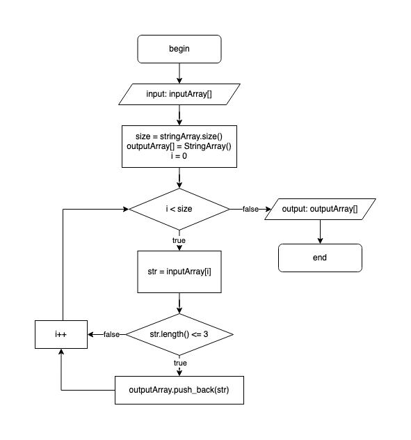

## Test for GeekBrains

### About this test
This test task is made in **C#** programming language as a test in the GeekBrains training program. The test consists of the source code of the program (file [`main.cs`](./main.cs)), the program algorithm (file `diagram.png`), and this [`README.md`](./README.md) file.

### How to check this test
The program code can be checked in the online compiler for **C#** at [THIS](https://www.onlinegdb.com/) link. Just copy the source code from the [`main.cs`](./main.cs) file and paste it into the online editor. Then, in the upper right corner, select the **C#** programming language and run the program.
As a result of the program execution, the following text will appear below:
```
Input array:
Hello world ! This is test on geegbrains 123 
Output array:
! is on 123 
```

### Block Diagram of the Algorithm

